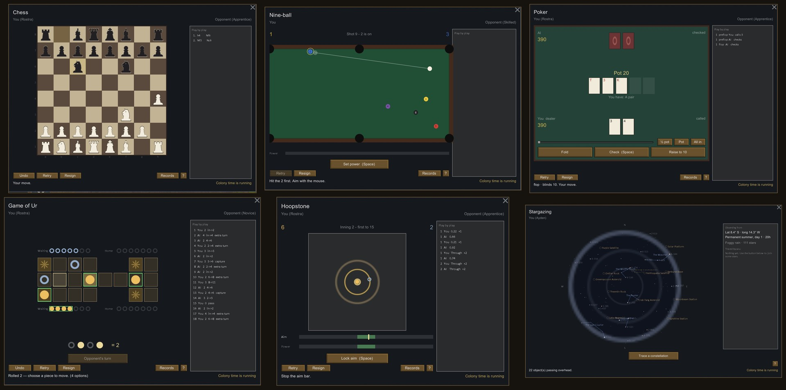

코드는 Claude Code(Opus)가 작성했고, 기획/명세/하네스/검증 시나리오/최종 판단은 김태령이 맡았습니다. 커밋의 Co-Authored-By 트레일러가 그 기록입니다.

# Playable Recreation

RimWorld의 오락 가구를 식민자 대신 플레이어가 직접 즐기는 RimWorld 1.6 모드입니다.

[Steam 창작마당에서 보기](https://steamcommunity.com/sharedfiles/filedetails/?id=3794530553)



## 일곱 가지 오락

- 우르의 게임, 체스, 포커, 나인볼, 편자 던지기, 후프스톤을 직접 플레이할 수 있습니다.
- 여섯 게임에는 초보부터 명인까지 AI 5단계, 규칙 안내, 연습 모드, 난이도별 전적이 있습니다.
- 별 보기에서는 월드 시드와 정착지의 위도·경도, 시각, 날씨에 따라 달라지는 하늘을 관측하고 별자리에 이름을 붙일 수 있습니다.
- 판을 진행하는 동안 콜로니 시간은 계속 흐르며, 위협으로 창이 닫혀도 진행 상태는 가구에 저장됩니다.

## 설치와 호환

- 대상 버전: RimWorld 1.6
- DLC: 불필요. Odyssey가 있으면 궤도 물체와 우주 지형의 하늘 표현이 추가됩니다.
- Steam 사용자는 [창작마당 페이지](https://steamcommunity.com/sharedfiles/filedetails/?id=3794530553)에서 구독하면 됩니다.
- 수동 설치는 릴리스 산출물을 RimWorld의 `Mods/Playable Recreation` 폴더에 배치합니다.
- 기존 세이브에 추가하거나 제거해도 안전하며, 멀티플레이는 지원하지 않습니다.

## 구현 방식

- C# / .NET Framework 4.7.2 기반입니다.
- Harmony 런타임 패치를 사용하지 않습니다.
- RimWorld의 XML `PatchOperationAdd`로 대상 가구마다 모드 컴포넌트 하나만 추가합니다. 바닐라 Def의 기존 값은 수정하거나 교체하지 않습니다.
- 핵심 게임 규칙과 AI는 엔진 의존성을 분리해 `Tests/PlayableRecreation.Tests`에서 검증합니다.
- `dist/`는 창작마당 업로드용 빌드 산출물이며 Git에는 추적하지 않습니다. 소스에서 `Tools/package.py`로 재생성할 수 있습니다.

## 역할

김태령은 게임 구성과 난이도 정책을 기획하고, RimWorld 모드 호환 방식과 저장 안전성 기준을 결정했으며, 실제 플레이와 배포본을 검증했습니다. 코드 구현은 위에 명시한 대로 Claude Code(Opus)가 담당했습니다.

## 빌드와 검증

```powershell
dotnet build Source/PlayableRecreation -c Release
dotnet test Tests/PlayableRecreation.Tests
python Tools/verify.py
python Tools/guistate.py
python Tools/package.py
```

## 라이선스

소스 코드, 테스트, XML 정의와 도구는 [MIT License](LICENSE)로 배포합니다. `About/`, `Sounds/`, `Textures/`, `Workshop/`의 이미지·오디오 리소스에는 이 라이선스가 재사용 권리를 부여하지 않습니다. RimWorld 및 관련 명칭과 자산의 권리는 각 권리자에게 있습니다.
